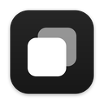

#  Screen for me

A fast, polished screenshot app for macOS and Linux, built with Tauri v2.

## Features

- Capture **area / window / fullscreen** from the menu-bar icon or with
  `Cmd/Ctrl+Shift+7 / 8 / 9`
- **Scrolling capture** (macOS): capture an entire scrolling page, stitched
  into one image
- **Timed capture** with an on-screen countdown
- A quick-access panel appears bottom-left after every capture: **copy,
  save, show in Finder, drag the image straight into other apps**
- Built-in **annotation editor**: arrows, rectangles, ellipses, lines, pen,
  highlighter, text, numbered counter steps, pixelate, crop — with undo/redo
  and native-resolution export
- **Customisable global shortcuts** from the Settings window
- **Localised** into English, Spanish, French, German and Italian (follows
  your system language by default)
- **Launch on start** option backed by the OS login-item state

## What's new in 1.2.2

- Settings for customising the capture shortcuts
- Numbered counter annotation tool
- Full localisation (en-GB, es, fr, de, it)
- New app icon

## Development

```bash
npm install
npm run tauri dev
```

macOS will ask for **Screen Recording** permission on first capture, and
**Accessibility** permission for scrolling capture.

## Build

```bash
npm run tauri build
```

## Contributors

- [Mario Alvarez](https://github.com/marioalna)
- [Jorge Alvarez](https://github.com/jorgegorka)

## License

Screen for me is available under the [MIT License](https://opensource.org/licenses/MIT).
