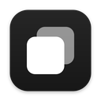

#  Screen for me

A fast, polished screenshot app for macOS and Linux, built with Tauri v2.

## Features

- Capture **area / window / fullscreen** from the menu-bar icon or with
  `Cmd/Ctrl+Shift+7 / 8 / 9`
- **Scrolling capture** (macOS): capture an entire scrolling page, stitched
  into one image
- **Timed capture** with an on-screen countdown
- **Screen recording** (macOS 15+): record a whole display to an .mp4 with
  `Cmd+Shift+0`, optionally with microphone narration — see
  [Screen recording](#screen-recording) below
- A quick-access panel appears bottom-left after every capture or
  recording: **copy, save, annotate, show in Finder, drag the file straight
  into other apps** — take several captures and they **stack as panels**,
  newest on top, each with its own actions
- **Capture history** window: browse recent captures and recordings, copy
  them, or **restore** one back into the quick-access panel
- New captures are **copied to the clipboard** automatically (optional),
  ready to paste
- Built-in **annotation editor**: arrows, rectangles, ellipses, lines, pen,
  highlighter, text, numbered counter steps, pixelate, crop — with undo/redo,
  zoom and native-resolution export
- **Customisable global shortcuts** from the Settings window
- **Localised** into English, Spanish, French, German and Italian (follows
  your system language by default)
- **Launch on start** option backed by the OS login-item state
- **Auto-updates**: checks GitHub Releases and updates in place

## Screen recording

Available on macOS 15 (Sequoia) or later. Screenshots keep working on
older versions; the recording items simply show an explanatory dialog.

1. Press `Cmd+Shift+0` or choose **Record Screen** from the menu-bar icon.
   A small panel appears with a **Microphone** toggle and a **Record**
   button. The microphone choice is remembered for next time.
2. Press **Record**. The panel shrinks to a pill showing the elapsed time.
   The display under the cursor is recorded; the app's own windows are left
   out of the video.
3. Stop with the pill's **Stop** button, `Esc`, `Cmd+Shift+0` again, or
   **Stop Recording** in the menu-bar menu.

The result is an `.mp4` (H.264, 30 fps, native Retina resolution, cursor
visible, microphone audio when enabled — system audio is not recorded). It
lands in the quick-access panel like a screenshot, with a poster-frame
thumbnail and a play badge, and can be **dragged into other apps**,
**saved**, **opened** or **shown in Finder**. Copy and Annotate are only
available for images.

Recordings also appear in **Capture history** alongside screenshots. History
keeps the 50 most recent captures and at most 10 videos; older ones are
deleted automatically.

The **Record screen** shortcut can be changed in Settings like the others.

## Development

```bash
npm install
npm run tauri dev
```

macOS will ask for **Screen Recording** permission on first capture,
**Accessibility** permission for scrolling capture, and **Microphone**
permission the first time you record with the microphone on.

## Build

```bash
npm run tauri build
```

## Contributors

- [Mario Alvarez](https://github.com/marioalna)
- [Jorge Alvarez](https://github.com/jorgegorka)

## License

Screen for me is available under the [MIT License](https://opensource.org/licenses/MIT).
